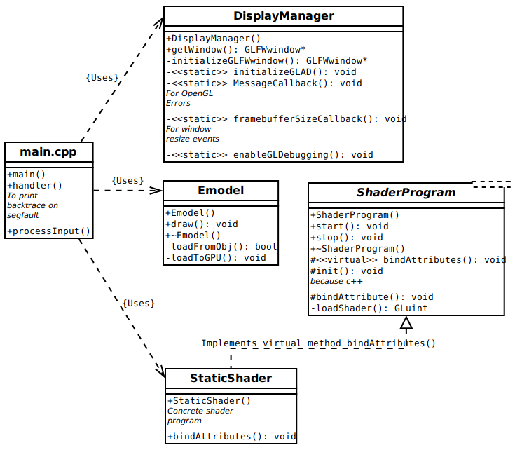
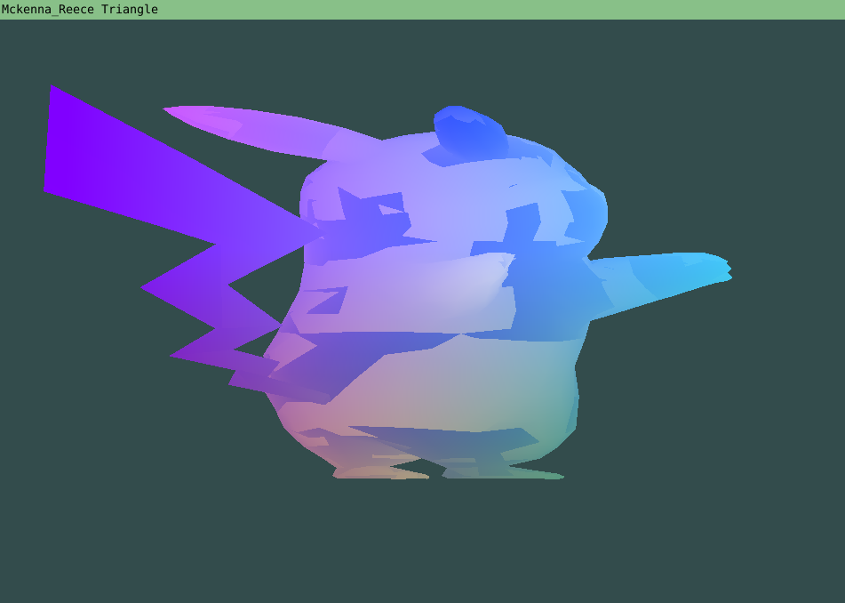
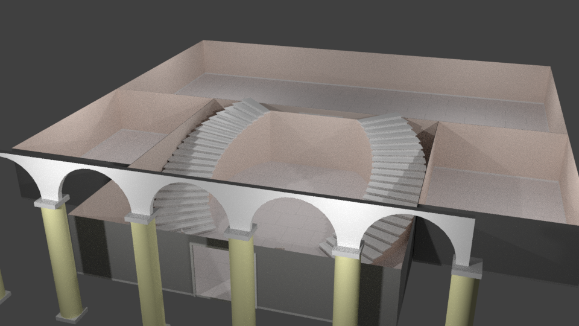
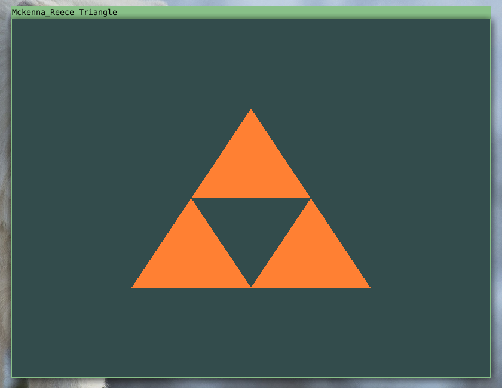
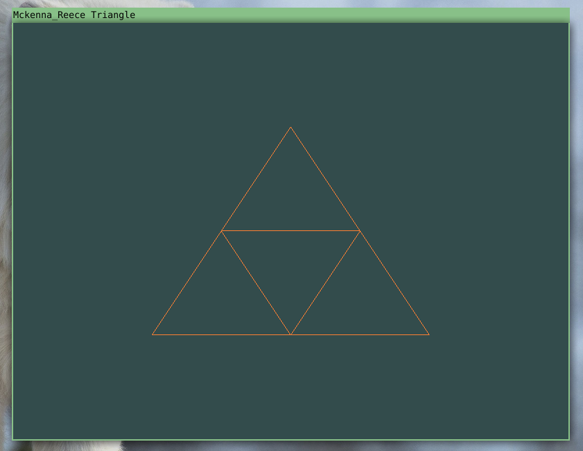

CSE 389 Museum project

## LATE Update: April 5th, 2018
### Boat is sinking, need to patch holes and not abandon ship
We have been having a tough time finding time to get the kinks fixed in out project. The Object loader is loadig correctly but does weird things with our large models. We hope to get the model loaded in with a camera for movement by next week and the get the textures done the week after. That should be about 90% of the project done. I (Jeriah) am going to try and bake in the lighting into the textures so that we do not have to deal with setting up lighting. If we have time, I would like to set up lighitng instead of the work around so that we can know how to do lighitng. But for now, this is our game plan. Sorry for the late release. S.O.S (boat sinking sounds)

## Update: March 29th, 2018 
### Emesh and Emodel loader seperation:
We hav esuccesfully refactored our code to properly load multimesh objects.
Now we can start to mess with the texture loader and getting our full model loaded in with a camera.

### TODO:
Load in 'full' museum model and the surrounding terrain
start loading in Textures and the various mappings to each object.
Get the Camera set up so one can move around the camera.
Get the camera to render in Perspective mode.

## Update: March 17th, 2018
### Assimp model loader:
We have finished the `assimp` model loader (at least the part we need so far)!
Currently, we can import vertex data and indices data from `assimp`
data structure.

### Indexed rendering system:
We have also finished the indexed rendering system. Our imported model can
now be rendered with `glDrawElements` instead of the old `glDrawArrays`.
This also means we don't have a bunch of weirdly connected vertices being
rendered because `assimp` doesn't guarantee the order of imported vertices
will be kept from the file.

### Shader loader and ShaderProgram class:
Thanks to our new ShaderProgram class, we can now load vertex and
fragment shaders from an external file! This means we don't have to
recompile our project every time we change a bit of shader code, and it
also makes it easier for us to read the shader code because it's not
wrappend in c++ string quotes.

### Reorganized project structure:
In addition to all the functioning features above, we have reorganized
our entire project structure to take better advantage of object
oriented programming techniques. We have tried to move as many things
out of `main()` and into their own classes as possible
(for example the ShaderProgram class).

As you can see above, there are 4 new classes in our project:
#### 1. DisplayManager
This class manages the initialization of a window that can be rendered
to by OpenGL calls. It also sets up some useful debugging error event handlers.
#### 2. Emodel
This class manages a single model. It is responsible for importing a model
from a .obj file, loading it into the GPU, and finally rendering (drawing)
the model onto the screen.
#### 3. ShaderProgram
This abstract class implements all the needed logic for loading a vertex shader
and fragment shader from text files into the GPU as a shader program.
#### 4. StaticShader
This concrete class gives specific details about a shader, such as what files
to load the vertex and fragment shaders from, and what attributes to
bind to the shader.

### Screenshots!:

### What's next?
* Occlusion handling. (The Pikachu looks kind of weird right now doesn't he.)
* Normal handling. (So we don't have to render so many triangles that aren't actually going to be seen.)
* Perspective camera transformation.
* Rendering multiple objects at once.
* More advanced input handling.

## Update: March 7th, 2018
We are currently still working on the model loader in the
[`model-loader-dev` branch](https://github.com/DragonAxe/Ekros/tree/model-loader-dev)

We are using the `assimp` library for loading models, then converting
from the assimp scene structure to two arrays, one for vertices and one for
indices. The loading of the model from the obj file works, converting the
assimp scene into the two arrays works, but there are problems with loading
the model into the GPU and rendering it correctly.

What we have been able to figure out so far is that rendering raw vertices
as triangles using the `glDrawArrays` command works, but rendering the
vertices using indices via the `glDrawElements` command doesn't work and
we haven't had time to investigate further.

We have also finished texturing the surrounding objects in our museum set up.
Below are some screen shots, and are not the final products.
They will be touched up and tweaked over time.

## Update: March 5th, 2018
We have moved all the code pertaining to loading and rendering a model into a
separate class, that way it will be easy to load and manage multiple objects
all at once.

The next step is to actually implement the model loader, rather than just
rendering a couple of triangles.

## Update: February 14th, 2018

The museum blender model can be found here: [MuseumModels/museum.blend](MuseumModels/museum.blend)

## Update: February 2nd, 2018

> Where are the screenshots?

> a. What is the theme of your museum?

  The theme of our museum is reflecting on the tragedy of our decisions. There will be displays of anguish, pain and sleeplessness from our peers in their natural habitat, Cramer.

> b. How many rooms will your museum have?

  Our museum will have, tentatively, 4 rooms plus the outside "starting point" for the museum.

> c. Have you started looking for textures for your museum walls/floors? If so, what are your plans?

  We have looked at some nice marble textures and have plans to possibly make our own textures using Crazybump.(http://crazybump.com/)

> d. Will your museum have a ceiling?  

  Yes. And also, probably, a sky box.

> e. You must have at least ONE “sculpture” in your museum.  What are you planning to use for
    your sculpture(s)?  NOTE: You DO NOT have to create your own blender model/sculpture, you
    are free to search the internet for a pre-made model. It is more important, for me, that you
    understand how these models are represented in the computer, and how they are manipulated in
    3D space.

 We plan on using a 3d scanning software to scan in our peers as statues. There are a few nice scanning softwares with free versions. (we have not decided on which to use yet. some of the models are very low quality. Limited to 5000 polygons.)

> f. You must have at least FOUR “paintings” in your museum.  What were you planning to use for
    your pictures? Have you already started looking for textures that can be applied as “pictures”?  
   Will your pictures be hung on the wall? Will they be murals?  Do you have a completely different
    idea of how these paintings will be added to your museum

 We plan on doing a a few different "paintings" in the museum. One will only be able to be seen properly from a certain angle, one will be a normal picture, the other will be an inserted statue to look like a painting, the final one will be a top down view of a topographical map.

## License
> The MIT License (MIT)
>
> Copyright (c) 2015 Kevin Fung
>
> Permission is hereby granted, free of charge, to any person obtaining a copy of this software and associated documentation files (the "Software"), to deal in the Software without restriction, including without limitation the rights to use, copy, modify, merge, publish, distribute, sublicense, and/or sell copies of the Software, and to permit persons to whom the Software is furnished to do so, subject to the following conditions:
>
> The above copyright notice and this permission notice shall be included in all copies or substantial portions of the Software.
>
> THE SOFTWARE IS PROVIDED "AS IS", WITHOUT WARRANTY OF ANY KIND, EXPRESS OR IMPLIED, INCLUDING BUT NOT LIMITED TO THE WARRANTIES OF MERCHANTABILITY, FITNESS FOR A PARTICULAR PURPOSE AND NONINFRINGEMENT. IN NO EVENT SHALL THE AUTHORS OR COPYRIGHT HOLDERS BE LIABLE FOR ANY CLAIM, DAMAGES OR OTHER LIABILITY, WHETHER IN AN ACTION OF CONTRACT, TORT OR OTHERWISE, ARISING FROM, OUT OF OR IN CONNECTION WITH THE SOFTWARE OR THE USE OR OTHER DEALINGS IN THE SOFTWARE.
